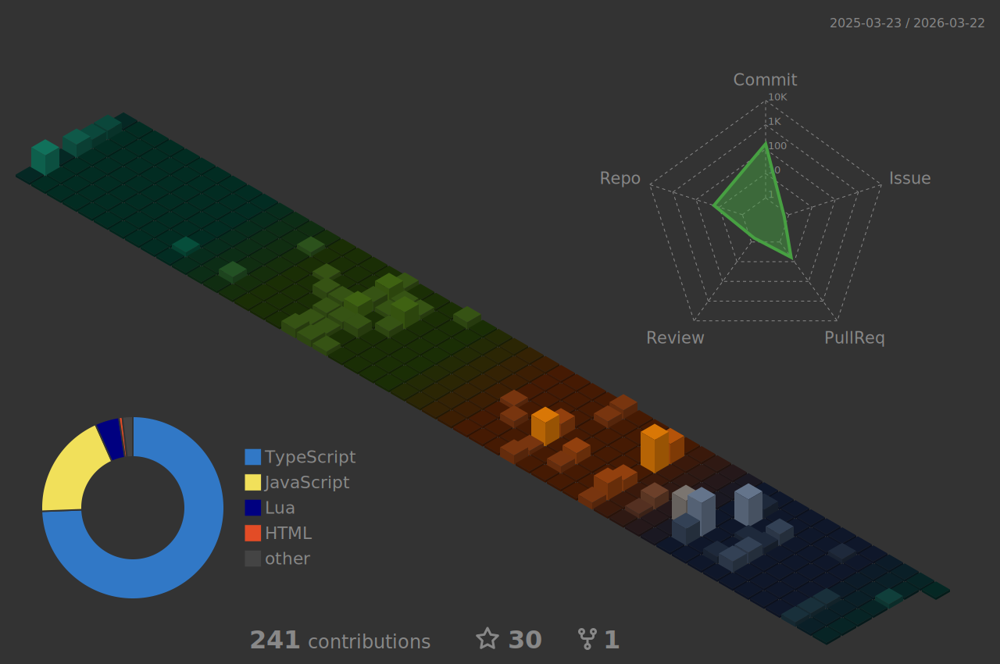

# Me Hrithic Raj 
I'm a MERN Stack Developer and a Fivem Developer

## 🌐 Socials:
   

## 💻 Tech Stack:
 
 
 
 

 
 
 
 

 

 
 

 
 
 
 
 
 
 
 
 
 
 
 
 
 

<!--  
 
 
 
 
 
 -->
<!-- # 📊 GitHub Stats: -->
<!--   -->

<!--  

 -->

<!-- ### 🔝 Top Contributed Repo

-->
## 💰 You can help me by Donating
 